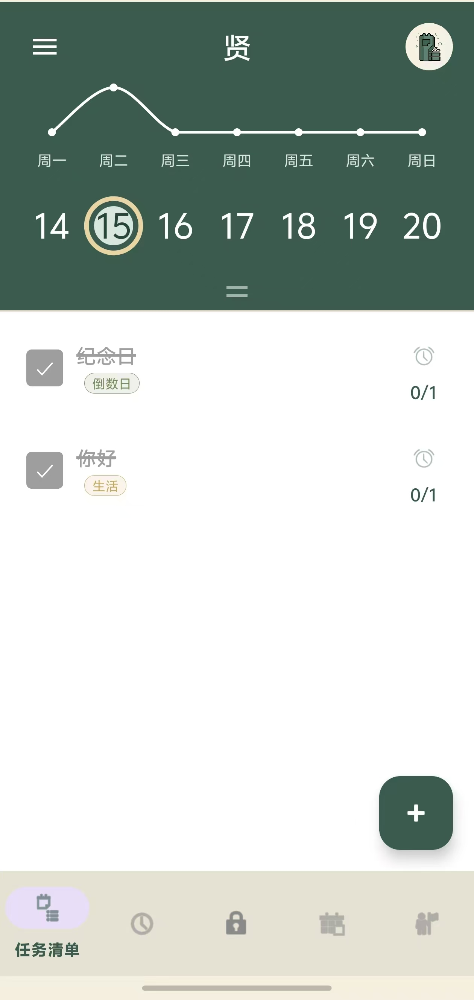
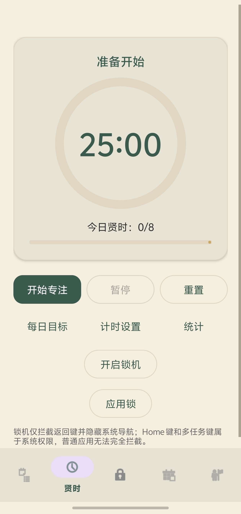
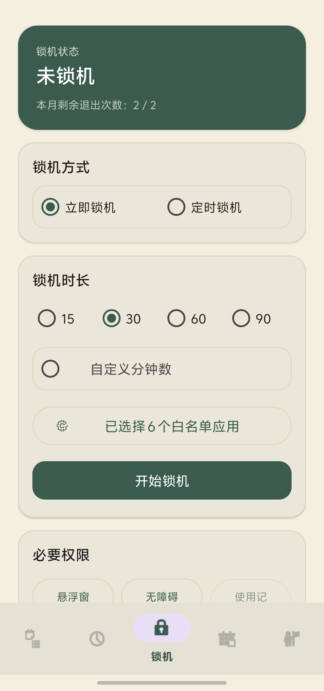
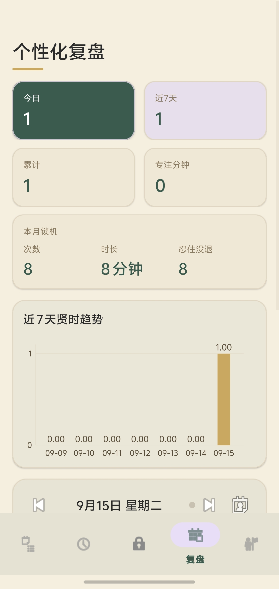
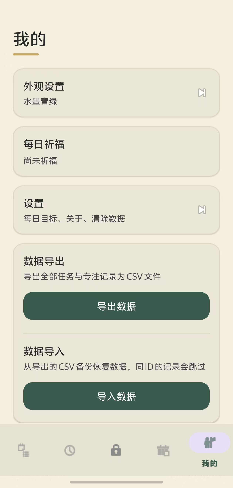

# 贤 · Xian

[](https://github.com/55kai12/Xian/releases/latest)
[](#构建)
[](PRIVACY.md)
[](LICENSE)

> 一款中国古风主题的 Android 专注与任务管理应用 —— 任务清单、番茄钟（贤时）、锁机专注、个性化复盘。
>
> 原创设计。无广告、不联网、不索取相机/存储/定位权限，数据全部留在本机。

**当前版本** `v2.0.66`（versionCode 266） · **最低系统** Android 8.0（API 26） · **目标系统** Android 15（API 35）

📦 **[下载最新版 APK](https://github.com/55kai12/Xian/releases/latest)** —— 已 v1 + v2 双重签名，国产 ROM 安装器可直接校验。

---

## 界面

<table>
  <tr>
    <td align="center"><br /><sub><b>任务清单</b><br />周视图 · 趋势线 · 倒数日</sub></td>
    <td align="center"><br /><sub><b>贤时</b><br />番茄钟 · 每日目标</sub></td>
    <td align="center"><br /><sub><b>锁机专注</b><br />时长 · 白名单 · 权限自检</sub></td>
    <td align="center"><br /><sub><b>个性化复盘</b><br />数据卡 · 近 7 天趋势</sub></td>
    <td align="center"><br /><sub><b>我的</b><br />主题 · 数据导入导出</sub></td>
  </tr>
</table>

---

## 核心功能

### 1. 任务清单
- 分类标签（自定义颜色）
- 截止日期、重复规则（每天 / 每周 / 每月 / 自定义）
- 子任务（可展开收起、自动编号）
- 工作量估算、系统日历提醒
- 周视图 + 月历下拉展开
- 每日完成趋势折线图
- 事件排序：按剩余天数 / 按日期 / 按创建时间

### 2. 贤时（番茄钟）
- 自定义专注时长（小时 + 分钟制）
- 每日贤时目标与进度条
- 专注前权限自检（无障碍、悬浮窗）
- 贤时统计与重置

### 3. 锁机专注
- 立即锁机 / 定时锁机（可配多个时间段，支持跨日）
- 锁机时长：15 / 30 / 60 / 90 分钟，或自定义
- 白名单应用（锁机期间仍可用）
- 月度退出额度（2 次/月）
- 退出需先过冷静期，可再叠加 PIN 码
- 开机自启、异常后自我恢复

### 4. 个性化复盘
- 今日 / 近 7 天 / 累计 / 专注分钟
- 本月锁机次数、时长、忍住没退次数
- 近 7 天贤时趋势
- 日记形式的每日状态（可左右翻日期、日历选日期）

### 5. 我的
- 四套古风主题：水墨青绿 / 朱砂宫墙 / 黛蓝远山 / 玄墨素纸
- 自定义壁纸
- 每日祈福（今日运势）
- 任务与专注记录导出 CSV，可按同 ID 跳过恢复

---

## 主题配色

默认主题「水墨青绿」：

| 用途 | 色值 |
| --- | --- |
| 主色（墨绿） | `#3B5B4E` |
| 背景（宣纸） | `#F5EFE0` |
| 点缀（古铜金） | `#C9A961` |

四套主题各自的完整配色定义在 `PomodoroFocus/app/src/main/res/values/themes.xml`，
通过自定义主题属性（`colorBrandSurface` / `colorBrandContent` / `colorOutline` / `colorBrandAccent`）注入。

---

## 技术栈

- **语言**：Kotlin
- **构建**：Gradle（Kotlin DSL）+ Android Gradle Plugin；Release 开启 R8 混淆与资源压缩
- **UI**：View 体系（ViewBinding）、Fragment、RecyclerView、自定义 Canvas 自绘图表
- **架构**：单 Activity + Fragment，`ViewModel` + `Repository`；任务 / 子任务 / 倒数日 / 专注记录走 **Room** 数据库，设置项、日记与壁纸走 `SharedPreferences`
- **关键系统能力**：`AccessibilityService`（前台应用感知）、`WindowManager` 悬浮窗、`UsageStatsManager`（应用限额）、`AlarmManager`（定时锁机）

第三方库：MPAndroidChart、CalendarView（com.haibin）、MaterialSpinner、colorpicker、SwitchButton、PinLockView、CircleImageView、picasso、AVLoadingIndicatorView。

> 已移除 **uTakePhoto**：该库会在 manifest 合并时带进 `CAMERA`、`READ_EXTERNAL_STORAGE`、
> `WRITE_EXTERNAL_STORAGE`、`ACCESS_COARSE_LOCATION` 四个敏感权限。选图功能早已改用
> 系统相册选择器（`ActivityResultContracts.OpenDocument`），属于纯多余的依赖。

---

## 构建

```bash
cd PomodoroFocus
./gradlew assembleRelease        # Release 已开启 R8 混淆 + 资源压缩
./gradlew assembleDebug          # 日常调试
```

构建产物：`app/build/outputs/apk/release/app-release.apk`

### 换机器构建前的准备

1. **`local.properties`** 需自行创建，写入 `sdk.dir=<你的 Android SDK 路径>`。

2. **`keystore.properties`** 需自行创建（**不要提交到仓库**）：
   ```
   storeFile=release.keystore
   storePassword=***
   keyAlias=***
   keyPassword=***
   ```
   缺失时 Release 包会以未签名方式产出。

3. **`gradle.properties`** 里目前硬编码了本机代理（`<本机地址>:<端口>`）与 JDK 绝对路径
   （`org.gradle.java.home`）。换机器请删掉这两处，否则 Gradle 会因连不上代理或找不到 JDK 而失败。

4. 依赖已缓存时可加 `--offline` 跳过联网检查。

> **签名提醒**：本项目 Release 构建显式开启了 `enableV1Signing = true`。AGP 对
> `targetSdk >= 30` 默认只保留 v2 签名，但部分国产 ROM 的安装器仍会校验 v1，缺失时报
> 「安装包损坏 / 解析包出错」。

---

## 权限说明

| 权限 | 用途 |
| --- | --- |
| `FOREGROUND_SERVICE` / `FOREGROUND_SERVICE_SPECIAL_USE` | 前台计时与锁机服务 |
| `POST_NOTIFICATIONS` | 计时状态与完成提醒 |
| `SYSTEM_ALERT_WINDOW` | 锁机悬浮遮罩 |
| `KILL_BACKGROUND_PROCESSES` | 锁机页「清空后台应用」按钮 —— 只清缓存进程，跳过贤自己与系统应用 |
| `RECEIVE_BOOT_COMPLETED` | 开机恢复锁机时间段 |
| `SCHEDULE_EXACT_ALARM` | 定时锁机与到期提醒的精确闹钟。**未授予也能用**：自动退化成不精确闹钟，只晚几十秒 |

> **「不联网」的技术依据**：Release 版 APK 的 Manifest 里**没有 `INTERNET` 权限**。
> 在 Android 上，未声明这条权限的应用无法建立任何网络连接 —— 所以这不是一句承诺，
> 而是系统层面的限制。可用 `aapt2 dump badging` 自行验证。

应用**不申请**相机、存储、定位权限，且**无任何 `WAKE_LOCK`**（周期任务走 `Handler.postDelayed`，
深睡自动停摆，不占后台电）。`allowBackup` 已关闭，任务库与日记不会被系统自动备份导出。

两个可选权限：

- **无障碍服务** —— 识别当前前台应用，锁机白名单与应用限额依赖它
- **使用情况访问** —— 备用的前台感知源

两者都不授予时锁机仍可用，但白名单可能失效。

---

## 目录结构

```
Xian/
├── PomodoroFocus/              # Android 项目源码
│   ├── app/
│   │   ├── src/main/           # 源代码、资源、Manifest
│   │   └── proguard-rules.pro  # Release 混淆规则
│   ├── gradle/                 # Gradle Wrapper
│   ├── build.gradle.kts        # 版本号在这里维护
│   ├── settings.gradle.kts
│   ├── local.properties        # 本地 SDK 路径（不入库）
│   └── keystore.properties     # 签名密钥配置（不入库，需自行创建）
├── docs/
│   └── 更新日志.md             # 逐版本完整更新史
├── screenshots/                # 界面截图
├── .gitignore
├── .gitattributes
├── LICENSE
├── PRIVACY.md                  # 隐私政策
└── README.md
```

---

## 版本规则

每交付一个 APK：`versionName` +0.0.1，`versionCode` 同步 +1（如 `2.0.63 / 263` → `2.0.64 / 264`）。
版本号**只在** `PomodoroFocus/app/build.gradle.kts` 中维护，本 README 顶部与 `docs/更新日志.md` 同步更新。

> 回退版本时**代码回退、版本号继续递增** —— 手机上已装的 `versionCode` 更高时，
> Android 会直接拒绝安装降级包（`INSTALL_FAILED_VERSION_DOWNGRADE`）。

---

## 相关文档

- 📄 [隐私政策](PRIVACY.md) —— 不联网的完整说明与权限边界
- 📝 [更新日志](docs/更新日志.md) —— 逐版本完整更新史
- ⚖️ [MIT License](LICENSE)

## 作者

**ShoweR** · **Yocai 咏材** · **55kai**

---

<p align="center"><sub>原创设计 · 无广告 · 不联网 · 数据全部留在本机</sub></p>
